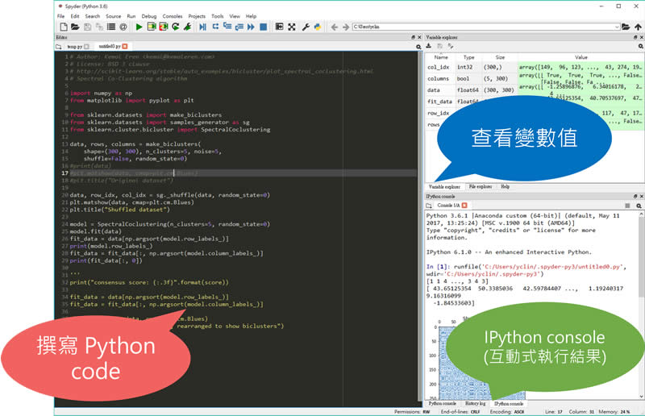

# 0.2 Python IDE 介紹

## Anaconda

* 圖形化編輯器 Spyder
* 線上編輯器 Jupyter Notebook

## Anaconda-Spyder

## Anaconda Features

* 開源、免費以及跨平台
* 內含 Spyder IDE 與 Jupyter notebook 環境
* 支援 Python 2.x, 3.x 與 R 語言
* 額外的加速、優化要收費，但學術用途可以申請免費
* 預設包含了眾多流行的科學、數學、工程、數據分析套件

[Anaconda package list](https://docs.continuum.io/anaconda/pkg-docs)
