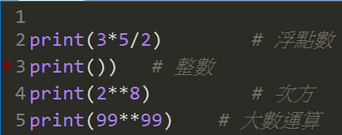
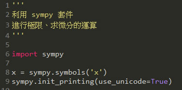
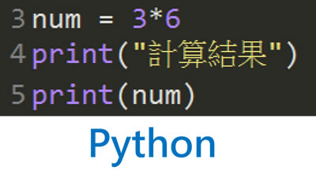
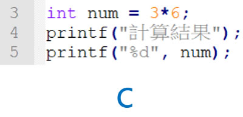
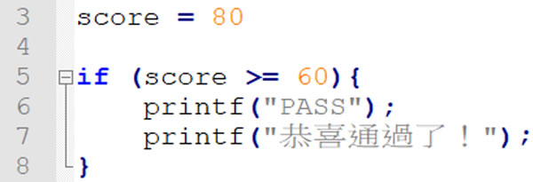
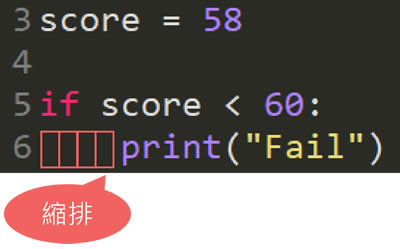
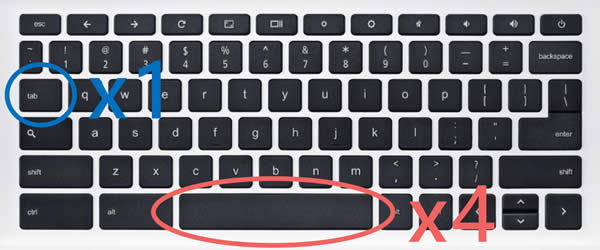
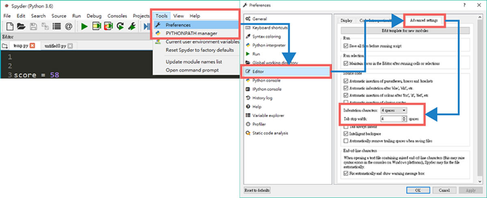

# 0.4 Python語法初探

## 註解(comment)

* 單行註解

  「\#」為 Python 的註解符號，程式執行時「\#」後面的程式碼不會執行，直接跳下一行。

* 多行註解

  「'''」為 Python 的多行註解符號，需成對出現

## 換行

Python 在每行敘述的結尾處 **不需要斷行符號**

 

## 縮排(indentation)

* 縮排是把程式碼依照結構作整理，使其有更高的可讀性

  大部分程式語言(e.g., C\C++, Java)是以一對大括號「{}」來表示程式區塊

## Python 的縮排

Python 以冒號「 **:**」及縮排來表示程式區塊

## Python 怎麼縮排？

## 用哪一種有差嗎？

* 「Tab」\*1
  * 優點：tab 鍵縮排的速度快、整齊、檔案小
  * 缺點：不同平台的編輯器會將 tab 字元視為不同長度，用不同編輯器打開，可能造成存取出錯、排版亂掉、檔案合併上的困難。

    e.g., Unix 是 8 個字元，Windows、OSX 是 4 個字元
* 「Space」\*4
  * 優點：不同平台的解讀有一致性
  * 缺點：鍛鍊手指肌肉

## 設定Tab為4個空格

## 密技

* 放大縮小
* 自動補齊(auto-complete)
  * Tab 鍵
* 快速註解多行
  * Ctrl + 1
