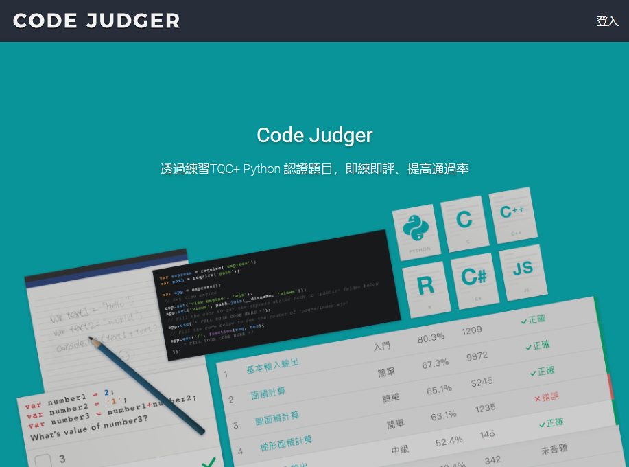
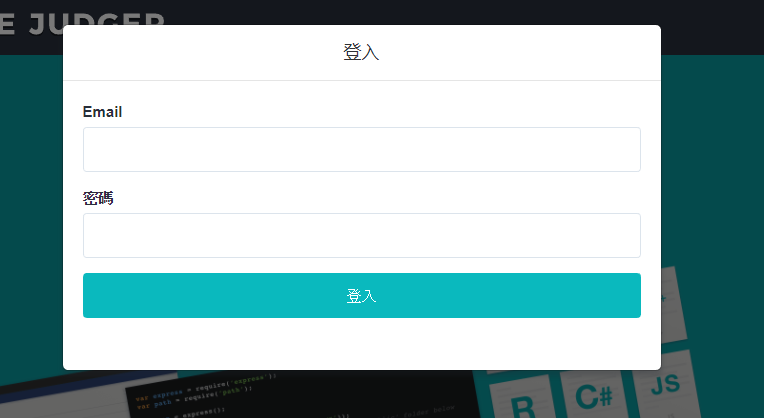

# 1 Code Judger特色

<table>
  <thead>
    <tr>
      <th style="text-align:center">重點特色</th>
      <th style="text-align:center">說　　明</th>
    </tr>
  </thead>
  <tbody>
    <tr>
      <td style="text-align:left">TQC+認證題庫</td>
      <td style="text-align:left">
      

      內建題庫包含：
        <ol>
          <li><a href="https://www.tqcplus.org.tw/CertificateDetail.aspx?CODE=oI628ByfbDY=">TQC+ 程式語言C</a></li>
          <li><a href="https://www.tqcplus.org.tw/CertificateDetail.aspx?CODE=y/zEfkGeQhM=">TQC+ 程式語言Python3</a></li>
          <li><a href="https://www.tqcplus.org.tw/CertificateDetail.aspx?CODE=n3V3YTVlWkQ=">TQC+ 網頁資料擷取與分析Python3</a></li>
          <li><a href="https://www.tqcplus.org.tw/CertificateDetail.aspx?CODE=j%201iCLklsBo=">TQC+ 網頁資料擷取與分析R</a></li>
          <li><a href="https://www.tqcplus.org.tw/CertificateDetail.aspx?CODE=oI628ByfbDY=">TQC+ 物件導向程式語言C#</a></li>
          <li><a href="https://www.tqcplus.org.tw/CertificateDetail.aspx?CODE=tcFNhoVP6T8=">TQC+ 物件導向程式語言Java</a></li>
        </ol>
        
將陸續增加其它認證題庫，如物件導向程式設計Java等。

      </td>
    </tr>
    <tr>
      <td style="text-align:left">作答即時回饋</td>
      <td style="text-align:left">題組式學習即練即評、精進自己的思考與解題能力。</td>
    </tr>
    <tr>
      <td style="text-align:left">完善的課堂輔助功能</td>
      <td style="text-align:left">
【僅適用校園教師】 具自動開始結束的考試功能、作業指派/收錄/評分、可自建題庫、學生個人、班級及系所分析功能。
      </td>
    </tr>
    <tr>
      <td style="text-align:left">跨裝置平台應用</td>
      <td style="text-align:left">可在電腦、手機、平板上運行。</td>
    </tr>
    <tr>
      <td style="text-align:left">支援的程式語言</td>
      <td style="text-align:left">包含：C, C++, C#, Java, R, Ruby, Python 3, Vb。</td>
    </tr>
    <tr>
      <td style="text-align:left">學習歷程</td>
      <td style="text-align:left">學習歷程全記錄、完美呈現。</td>
    </tr>
  </tbody>
</table>

當您具有[Code Judger](http://www.codejudger.com)帳號時，請點選網頁右上角的［登入］按鈕

請輸入您的Email及密碼，Code Judger會自動判斷您的帳號是屬於教師或學生。
