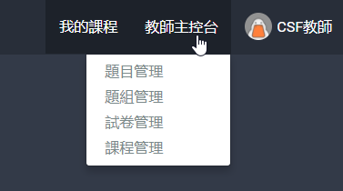

# 2 【教師】主控台

以教師帳號登入[Code Judger](http://www.codejudger.com)，主控台的功能介紹。

- [2.1 題目管理](chapter2/console-2-1.md)
- [2.2 題組管理](chapter2/console-2-2.md)
- [2.3 試卷管理](chapter2/console-2-3.md)
- [2.4 課程管理](chapter2/console-2-4.md)

