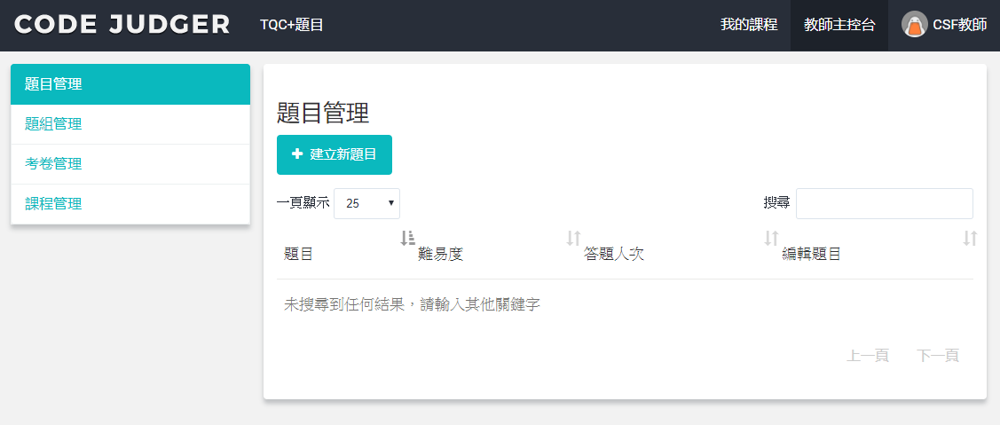
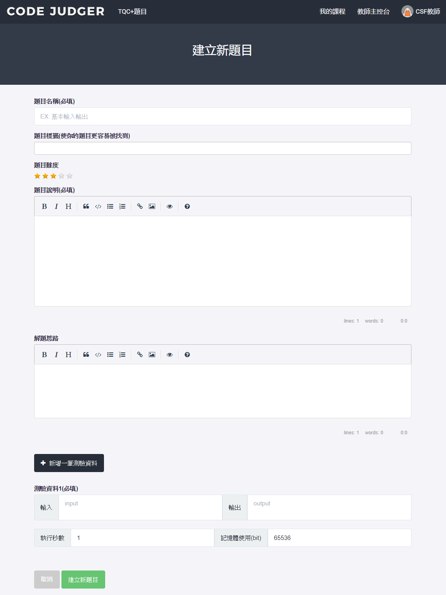
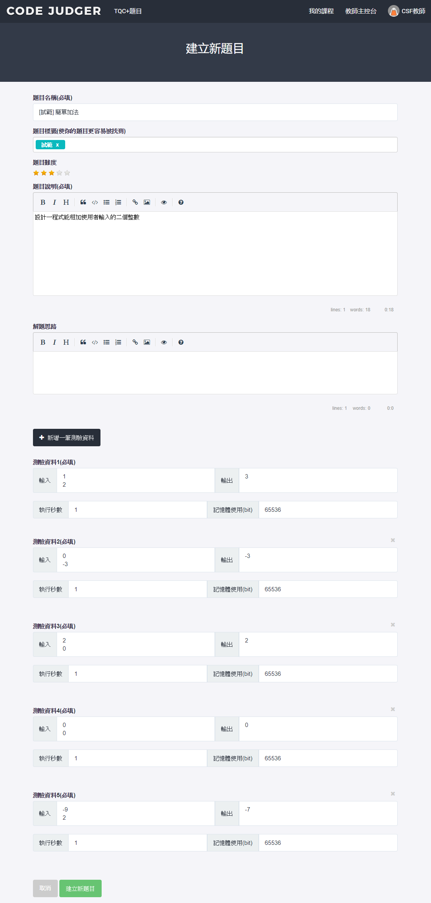
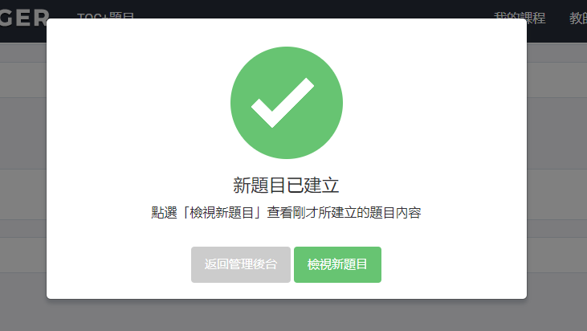
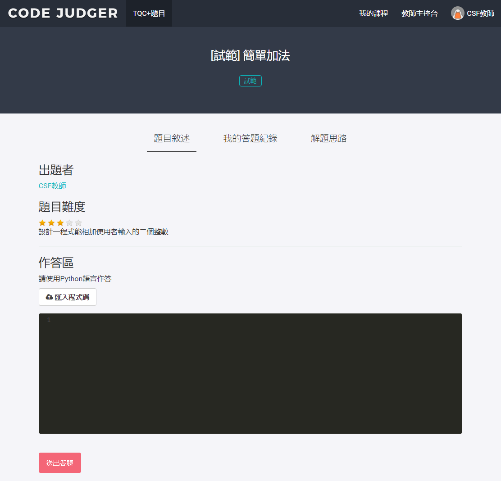

# 2.1.1 建立新題目

在題目管理中點選［建立新題目］按鈕，即可進入建立題目的頁面。

<table>
  <thead>
    <tr>
      <th style="text-align:center">項目</th>
      <th style="text-align:center">說明</th>
    </tr>
  </thead>
  <tbody>
    <tr>
      <td width="147">題目名稱(必填)</td>
      <td>題組、分析等功能皆使用此名稱</td>
    </tr>
    <tr>
      <td>*題目標籤</td>
      <td>此功能暫不開放</td>
    </tr>
    <tr>
      <td>題目難度</td>
      <td>1~5顆星</td>
    </tr>
    <tr>
      <td>題目說明(必填)</td>
      <td>描述題目的要求 編寫方式為Markdown語法</td>
    </tr>
    <tr>
      <td>解題思路</td>
      <td>告知學生此題的解題邏輯及方法，此欄填寫的內容，會出現在題目練習之中， 但不會出現在考試之中 編寫方式為Markdown語法</td>
    </tr>
    <tr>
      <td>新增一筆測驗資料</td>
      <td>再新增一筆測資 一份題目，通常會需要多筆的測資，以驗證學生作答的程式是符合題目的要求， 例如：判斷質數，假設題目的設計要求判斷0, 質數, 合數，則測資就需要3筆</td>
    </tr>
    <tr>
      <td>測驗資料1(必填)</td>
      <td>為評核題目使用的參數， 每一筆測資都需要增加輸入、輸出、執行秒數及記憶體使用(bit)</td>
    </tr>
    <tr>
      <td>輸入</td>
      <td>要驗證程式的輸入資料</td>
    </tr>
    <tr>
      <td>輸出</td>
      <td>要驗證程式的輸出資料</td>
    </tr>
    <tr>
      <td>執行秒數</td>
      <td>不需更改，預設為1秒</td>
    </tr>
    <tr>
      <td>記憶體使用(bit)</td>
      <td>預設為65536 Python的題目，建議至少更改為6553600</td>
    </tr>
  </tbody>
</table>

### 建立新題目 範例

［範例］

此題要求相加使用者輸入的二個整數。 故各筆測資的輸入輸出如下：

| 筆數  | 輸入  | 輸出  |
| :---: | :---: | :---: |
|   1   |  1 2  |   3   |
|   2   | 0 -3  |  -3   |
|   3   |  2 0  |   2   |
|   4   |  0 0  |   0   |
|   5   | -9 2  |  -7   |

## 測試新題目

當題目設計完成，按下［建立新題目］鈕後，系統會告知新題目已建立，並可進行檢試。

檢視的畫面如下，命題者可立即進行題目檢測

