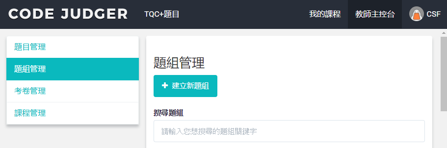
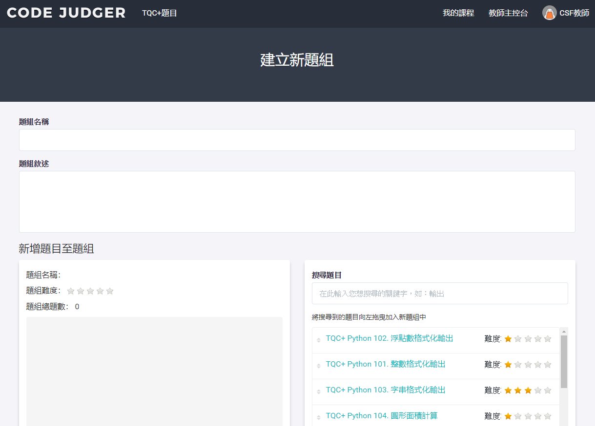

# 2.2.1 建立新題組

在題組管理中點選［建立新題組］按鈕，即可進入建立題組的頁面。

\*\*

\*\*

| 項目 | 說明 |
| :--- | :--- |
| 題組名稱 | 必填 請建立易於理解辨識的名稱，方便後續的管理辨識 |
| 題組敍述 | 詳細的描述此題目的內容及用途 |
| 新增題目至題目 | ● 分為2左右區塊，將右方區域的題目，拖拉至左方區塊即可 ● 系統會即時計算此題組的難易度及總題數 ● 題序可自由排列 |

