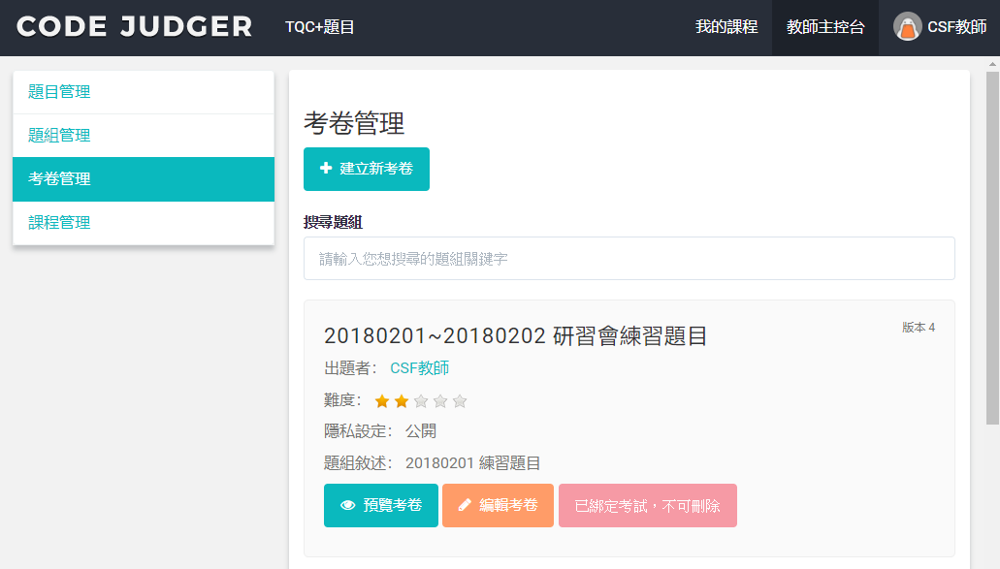
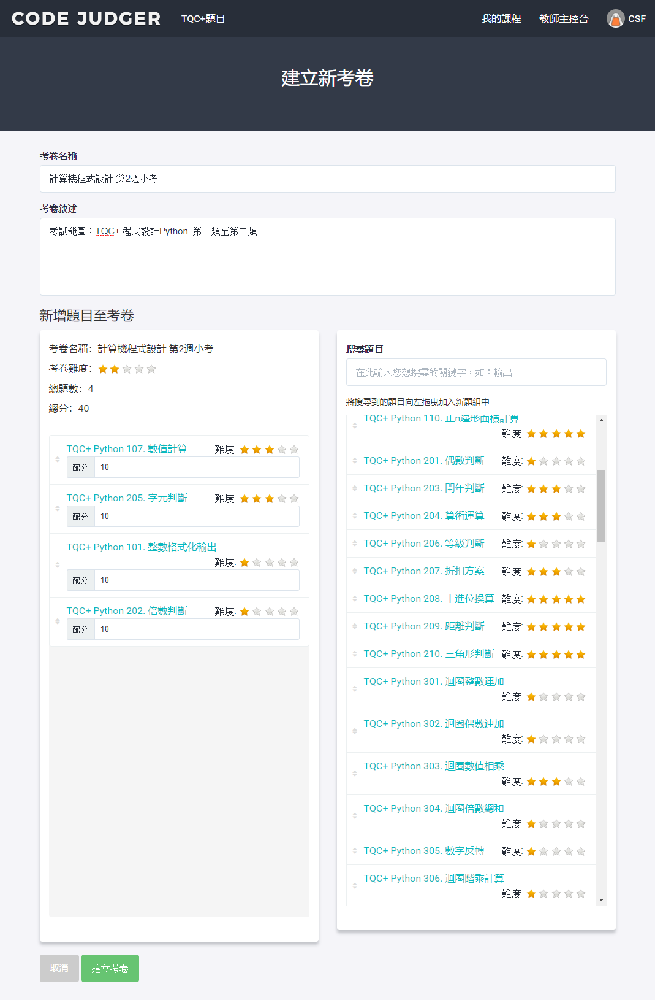

# 2.3 試卷管理

考卷管理具備［建立新考卷］、［預覽考卷］及［編輯考卷］三項功能！

在考卷管理中點選［建立新考卷］按鈕，即可進入建立考卷的頁面。

## 建立考卷

| 項目           | 說明                                                                                                                                                   |
| :------------- | :----------------------------------------------------------------------------------------------------------------------------------------------------- |
| 考卷名稱       | 必填 請建立易於理解辨識的名稱，方便後續的管理辨識                                                                                                      |
| 考卷敍述       | 詳細的描述此考卷的內容及用途                                                                                                                           |
| 新增題目至考卷 | ● 分為2左右區塊，將右方區域的題目，拖拉至左方區塊即可  ● 系統會即時計算此題組的難易度及總題數   ● 每一題都可設定不同的分數   ● 題序可自由排列 |

## 編輯考卷

如已有考卷，則可在［考卷管理］中看到已存在的考卷，可透過［編輯考卷］按鈕進行編輯。

操作方式與［建立新考卷］相同。
