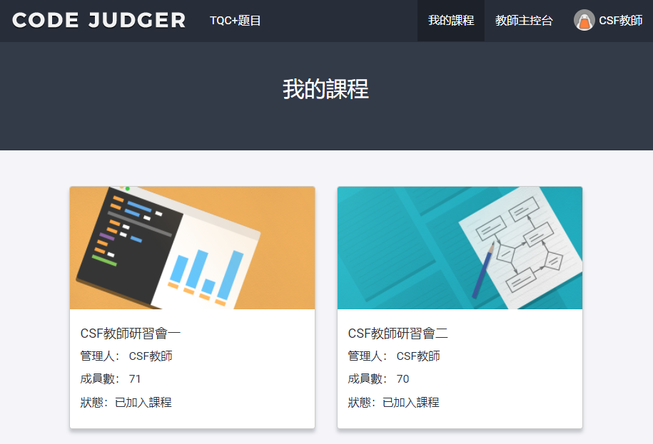
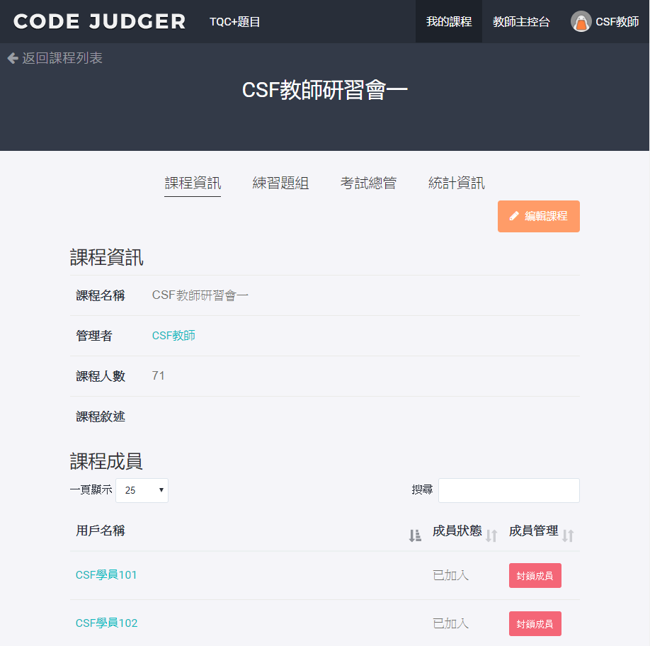

# 3 【教師】我的課程

以教師帳號登入[Code Judger](http://www.codejudger.com)，課程的功能介紹。

* [3.1 課程資訊](class-3-1.md)
* [3.2 練習題組](class-3-2/)
* [3.3 考試總管](class-3-3/)
* [3.4 統計資訊](class-3-4.md)

登入Code Judger後，會進入「我的課程」頁面，請選擇要進入的課程。

## 功能

進入選擇的課程後，共有3個功能：

* 課程資訊：課程的學員資訊。
* 練習題組：課程練習的題組題目。
* 考試總管：課程的考試。
* 統計資訊：課程的考試。

