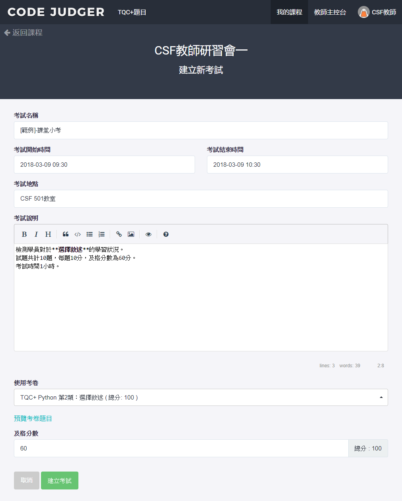

# 3.4.1 新增考試

在考試總管中，點選［新增考試］按鈕，即可進入建立新考試的頁面。

透過設定考試開始及結束時間，即可達成自動開始結束的考試功能。

學生如在時間內作答完成，只須登出Code Judger即可離場。

| 項目         | 說明                                                                      |
| :----------- | :------------------------------------------------------------------------ |
| 考試名稱     | 必填 請建立易於理解辨識的名稱，方便後續的管理，以及學生在選擇考試時的辨識 |
| 考試開始時間 | 考試開始時間 在開始時間之前，學生是無法進入考試。                         |
| 考試結束時間 | 考試結束時間 在結束時間之後，學生是無法再進入考試。                       |
| 考試地點     | 教室地點                                                                  |
| 考試說明     | 考試內容、用途的描述                                                      |
| 使用考卷     | 選擇要使用的考卷                                                          |
| 預覽考卷     | 檢視考卷頁面                                                              |
| 及格分數     | 設立本次考試的及格分數                                                    |
| 總分         | 考卷的總分，依據所使用考卷的總分                                          |

