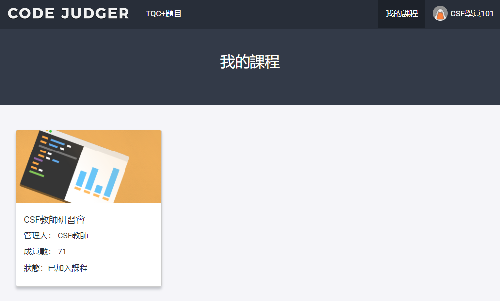
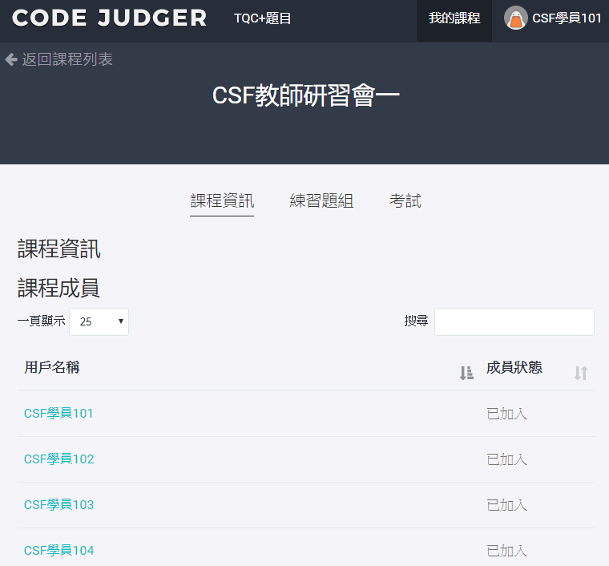

# 4 【學生】我的課程

以學生帳號登入[Code Judger](http://www.codejudger.com)，可使用的功能介紹。

* [4.1 我的課程](chapter4/4-1myclass.md)
* [4.2 練習題目](chapter4/4-2myclass/)
* [4.3 考　　試](chapter4/4-3myclass/)

登入Code Judger後，會進入「我的課程」頁面，請選擇要進入的課程。

## 功能

進入選擇的課程後，共有3個功能：

* 課程資訊：課程的學員資訊。
* 練習題組：課程練習的題組題目。
* 考試：課程的考試。

